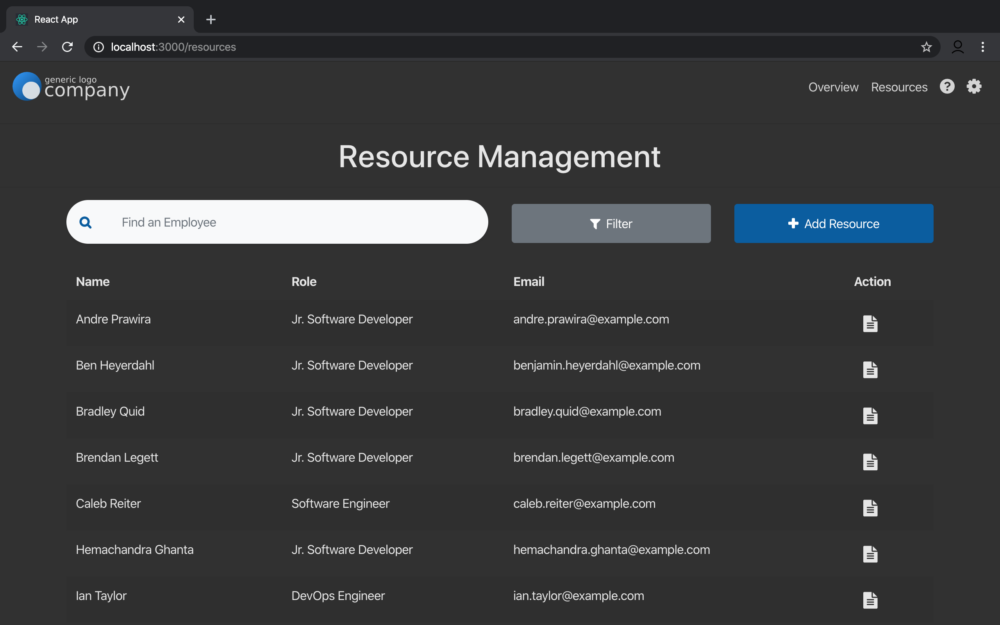

# ResourceManagement

React Application with lightweight Node.js and Express Back-End <br/> 


### Theming <br/>
<table width=100%>
 <td></td>
 <td></td>
</table>

### To Demo <br/>
* BackEnd (http://localhost:5000): <br/>
```
  cd BackEnd
  npm i
  npm start
```
* FrontEnd (http://localhost:3000): <br/>
```
  cd FrontEnd
  npm i 
  npm start
```

### TODO <br/>
* Pagination <br/>
* D3.js Graphs on Overview Page <br/>
* Form Validation <br/>
* Populate Help Page <br/>
* Add more Skills <br/>
* Edit Dark Theme CSS <br/>
